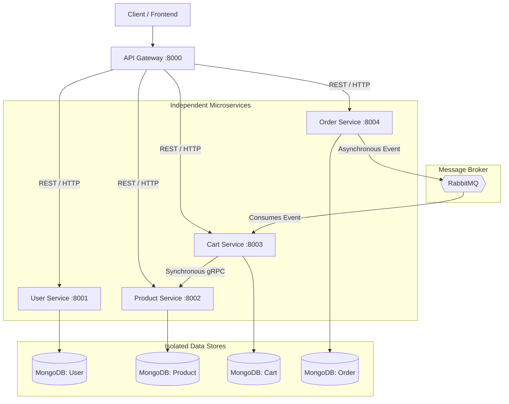

# Zapp Distributed - Microservices Architecture

## Overview

This repository represents the backend infrastructure for the Zapp e-commerce application. It has been built using a polyglot, distributed microservices architecture to ensure high scalability, fault tolerance, and clear domain boundaries.

The system relies on an API Gateway pattern to route edge traffic, dedicated databases per microservice to prevent data coupling (Database-per-Service pattern), RabbitMQ for asynchronous event-driven choreography, and gRPC for high-performance internal synchronous communication.

## System Architecture

The following diagram represents the data flow and communication protocols utilized across the microservices.



## Core Components

### 1. API Gateway (Port 8000)
Acts as the single entry point into the system. Responsibilities include routing HTTP reverse-proxy traffic to respective downstream microservices, validating authentication signatures (JWT), and dropping unauthorized traffic before it impacts internal services.

### 2. User Microservice (Port 8001)
Handles authentication, authorization, and profile management. 

### 3. Product Microservice (Port 8002 & 50051)
Maintains the product catalog. Unique to this service is its polyglot nature:
- **Express Server (Port 8002):** Serves queries coming directly from the API gateway for frontend web consumption.
- **gRPC Server (Port 50051):** Serves highly optimized, binary-serialized data exclusively for internal backend microservices (e.g., Cart Service).

### 4. Cart Microservice (Port 8003)
Manages user cart sessions. 
- Utilizes **gRPC (Protocol Buffers)** to fetch real-time product prices and metadata from the Product Service synchronously, bypassing HTTP/JSON overhead.
- Utilizes an event-driven listener to empty a user's cart asynchronously when an order is completed.

### 5. Order Microservice (Port 8004)
Handles payment gateways (Razorpay processing) and invoice generation. Instead of coupling itself to other services post-purchase, it emits transactional events (e.g., `order.payment.successful`) to the RabbitMQ exchange.

## Communication Patterns

* **North-South Traffic (External):** Standard REST over HTTP/1.1 handled by the API Gateway mapping edge traffic to service boundaries.
* **East-West Traffic (Internal Synchronous):** Implemented via gRPC. Services that require immediate dependency resolution (e.g., Cart validating a Product ID) utilize binary streams over HTTP/2 to reduce latency bottlenecks.
* **East-West Traffic (Internal Asynchronous):** Implemented via RabbitMQ. Used for choreography where services do not require immediate resolution (e.g., Orders notifying the Cart to clean up). This ensures eventual consistency while decoupling systemic failures.

## Setup & Local Development

Install dependencies and start each service independently. Note that a local instance of MongoDB and RabbitMQ must be running.

### Environment Variables
Each service requires an independent `.env` configuration file containing at least the `PORT` and `MONGO_URI`.

### Running the Environment
```bash
# Terminal 1
cd api-gateway && npm start

# Terminal 2
cd user && npm start

# Terminal 3
cd product && npm start

# Terminal 4
cd cart && npm start

# Terminal 5
cd order && npm start
```
