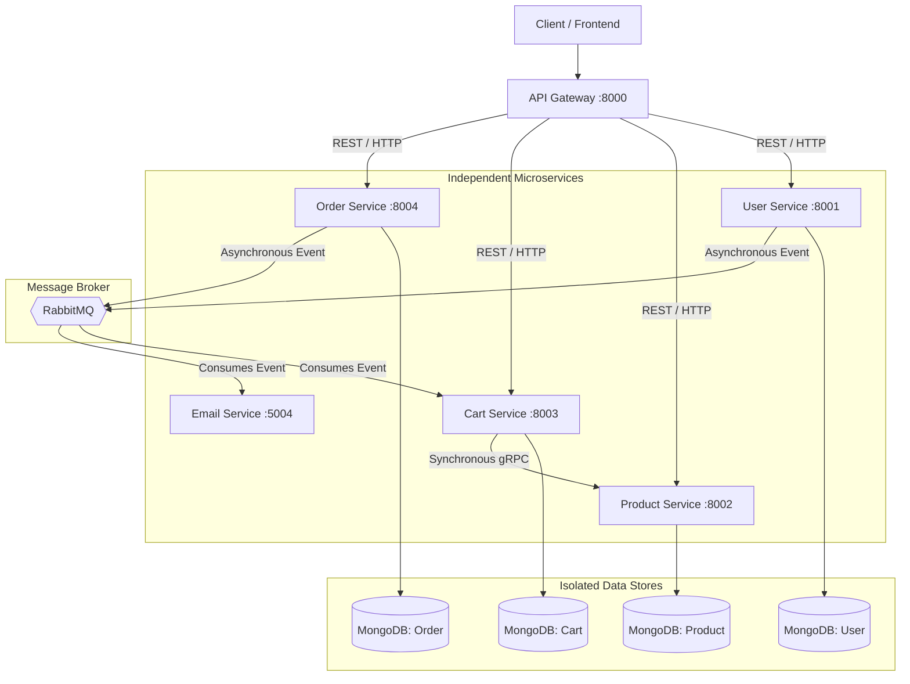

# Zapp Distributed - Microservices Backend

> A polyglot, distributed, and highly-scalable e-commerce platform backend architected with Node.js, RabbitMQ, gRPC, and MongoDB.


##  Overview

The **Zapp Distributed** ecosystem represents the foundational infrastructure for a high-traffic e-commerce application. It abandons the traditional monolith structure in favor of a strictly bounded microservice architecture. 

By utilizing the **Database-per-Service** pattern, Zapp prevents data coupling and enforces domain isolation. Furthermore, it dynamically leverages both synchronous and asynchronous networking depending on latency requirements: fast inter-service lookups happen over `gRPC`, while downstream side-effects (like emailing and cart management) are offloaded to `RabbitMQ` message choreography.

---

##  System Architecture

Our distributed architecture manages traffic through an API Gateway, shielding internal networks, and implements robust fail-safes like auto-reconnecting loops and Dead Letter Exchanges.



---

## 🧩 Core Microservices

### 1.  API Gateway (Port 8000)
Acts as the single entry point into the system. Responsibilities include routing HTTP reverse-proxy traffic to respective downstream microservices, validating authentication signatures (JWT), and dropping unauthorized traffic before it impacts internal services.

### 2.  User Service (Port 8001)
Handles authentication, authorization, and profile management. Publishes events like `user.registered` directly to the network allowing background workers to handle email handshakes asynchronously.

### 3.  Product Service (Port 8002 & 50051)
Maintains the product catalog. Unique to this service is its polyglot networking layer:
- **Express Server (Port 8002):** Serves queries coming directly from the API gateway for frontend web consumption.
- **gRPC Server (Port 50051):** Serves highly optimized, binary-serialized data purely for internal backend microservices (e.g., Cart Service requesting product prices natively).

### 4.  Cart Service (Port 8003)
Manages user cart sessions. 
- Utilizes **gRPC (Protocol Buffers)** to fetch real-time product prices and metadata from the Product Service synchronously, bypassing HTTP/JSON overhead.
- Utilizes an event-driven listener to empty a user's cart asynchronously when an order is completed.

### 5.  Order Service (Port 8004)
Handles payment gateways (Razorpay processing) and invoice generation. Instead of coupling itself to other services post-purchase, it emits transactional events (`order.created`, `order.payment.successful`) to the RabbitMQ exchange.

### 6.  Email Service (Port 5004)
A dedicated background worker service handling all third-party outbound communications.
- **Asynchronous Only:** Listens directly to RabbitMQ topics (`user_exchange`, `order_exchange`) preventing main-thread blocking during expensive I/O.
- **Fail-Safe Design:** Implements Dead Letter Queues (DLQ) to meticulously catch and store any formatting or networking failures instead of permanently discarding messaging data.

---

##  Communication Patterns

- **North-South Traffic (External):** Standard REST over HTTP/1.1 handled by the API Gateway mapping edge traffic to service boundaries.
- **East-West Traffic (Internal Synchronous):** Implemented via **gRPC**. Services that require immediate dependency resolution utilize binary streams over HTTP/2 to prevent latency bottlenecks.
- **East-West Traffic (Internal Asynchronous):** Implemented via **RabbitMQ**. Used for choreography where services do not require immediate data returns. This ensures eventual consistency while decoupling systemic failures.
- **Fault Tolerance & Healing:** The architecture utilizes RabbitMQ connection auto-retry loops on disconnect scenarios and rigorously captures failures natively within a unified Dead Letter Queue architecture (`email_dlx` & `email_dlq`).

---

##  Setup & Local Development

### 1. Prerequisites
You must have the following installed locally or running via Docker:
- Node.js (v18+)
- MongoDB daemon (running on `:27017` typically)
- RabbitMQ server (running on `:5672` typically)

### 2. Environment Variables
Every service directory contains its own execution space. Create a `.env` in the root of *each* microservice folder. Example standard configurations:

**User Service (`/user/.env`)**
```env
PORT=8001
MONGO_URI=mongodb://localhost:27017/zapp_user
SECRET_KEY=your_jwt_secret
RABBITMQ_URL=amqp://localhost
```

**Email Service (`/email/.env`)**
```env
PORT=5004
RABBITMQ_URL=amqp://localhost
MAIL_USER=your_smtp_email
MAIL_PASS=your_smtp_password
```

*(Ensure you provide Razorpay keys in the Order service `.env`, and similar setups for Cart and Product).*

### 3. Running the Stack
To boot the full architecture in a local development environment, open up multiple terminal tabs and run the following:

```bash
# Terminal 1 - API Gateway
cd api-gateway && npm install && npm start

# Terminal 2 - User Service
cd user && npm install && npm start

# Terminal 3 - Product Service
cd product && npm install && npm start

# Terminal 4 - Cart Service
cd cart && npm install && npm start

# Terminal 5 - Order Service
cd order && npm install && npm start

# Terminal 6 - Email Worker
cd email && npm install && npm start
```

### 4. Validating the Stack
When successful, you will notice console outputs verifying the setup:
- MongoDB connections will display `Mongodb Connected Successfully`
- Services connecting to the Broker will display `Connected to RabbitMQ in [Domain] Service`
- The Product service will note `gRPC Server running on port 50051`.
